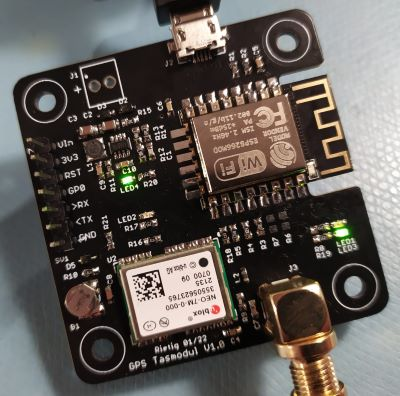

# Tasmodul GPS
A module to get live GPS coordinates into MQTT with Tasmota or other home automation systems

## Features
* SMA connector for external GPS antenna
* Micro USB for powering and data access

## Notes
* The battery (ML414H_IV01E) can be ordered on AliExpress, that's probably the easiest way
* Tasmota does not include GPS capability by default. It has to be compiled with custom parameters to include it

